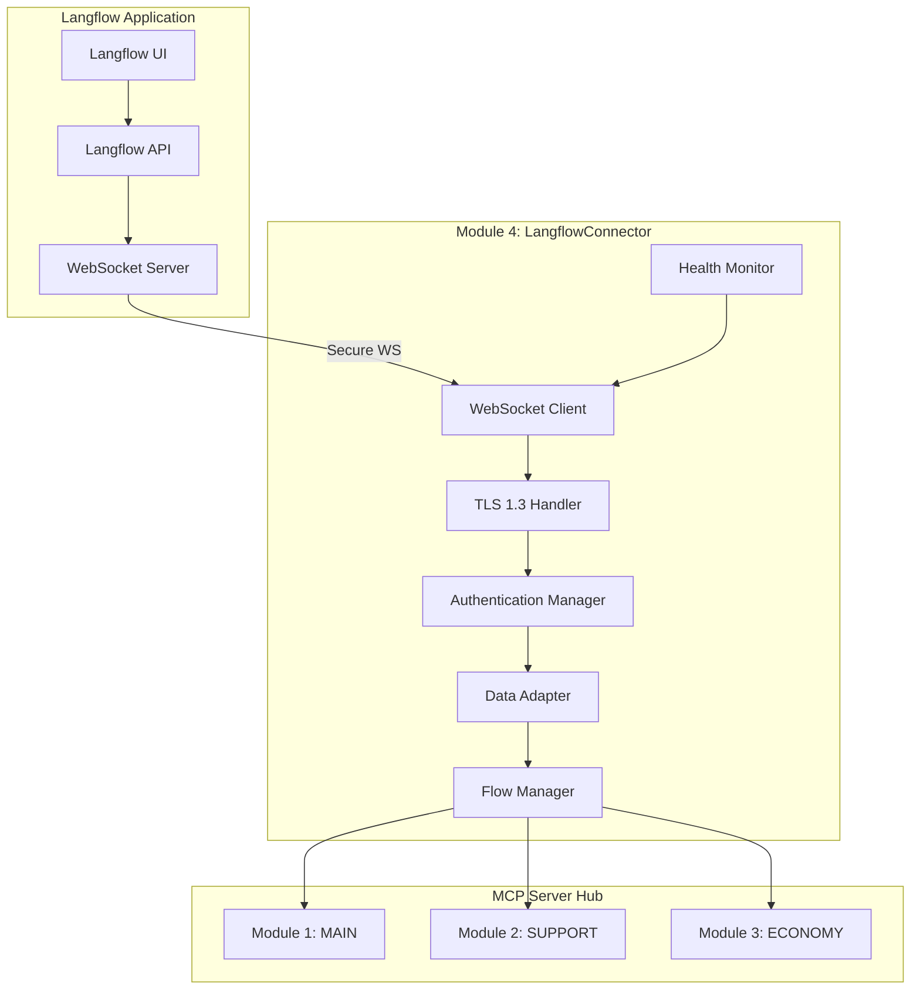
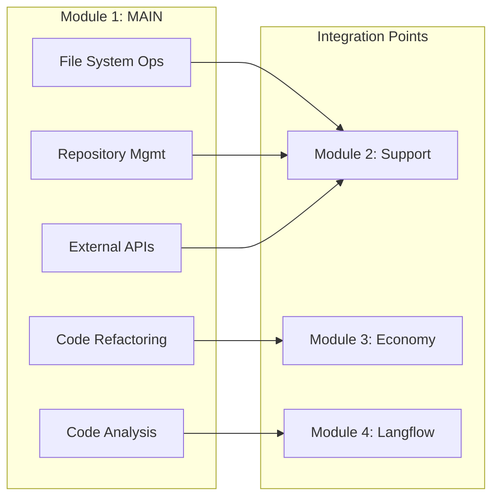
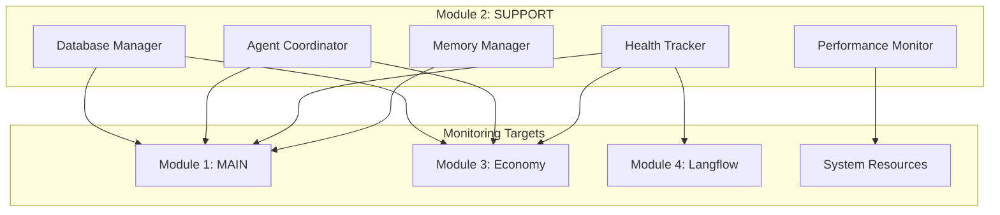
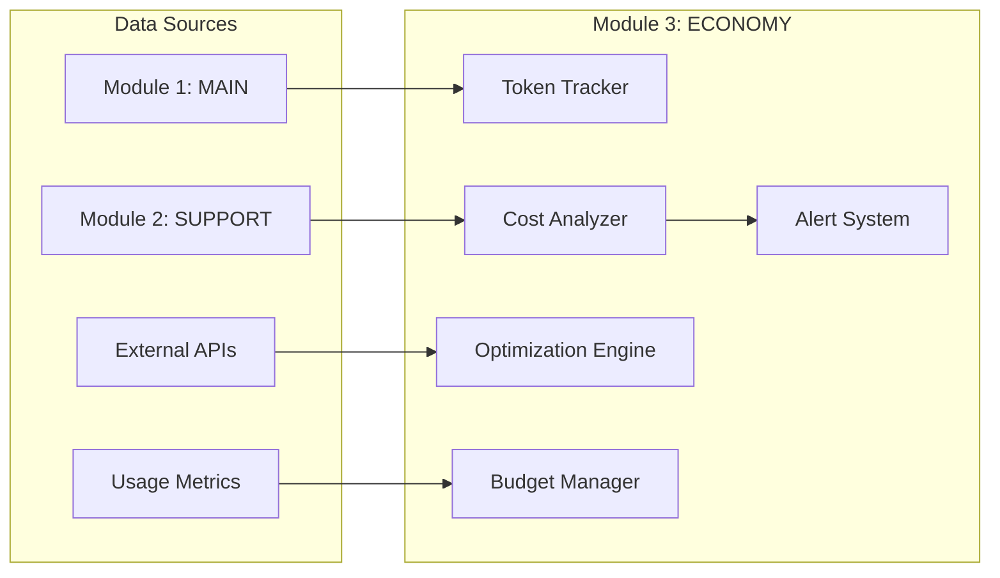
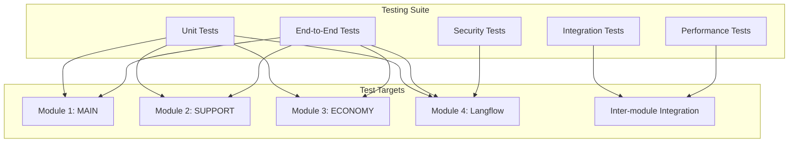

# Langflow Connection & Modular MCP System Strategy

## 🎯 **Executive Summary**

This document outlines the comprehensive strategy for securing local MCP connection to Langflow and developing a modular, enterprise-grade system architecture. The system will be divided into four specialized modules with secure, stable connections and full Langflow integration capabilities.

---

## 🏗️ **System Architecture Overview**

### **Modular Design Philosophy**

```
┌─────────────────────────────────────────────────────────────────┐
│                    LANGFLOW APPLICATION                        │
│  ┌─────────────────────────────────────────────────────────┐   │
│  │              Module 4: LangflowConnector                │   │
│  │  • Secure Connection Management                         │   │
│  │  • Langflow Documentation & Code Generation             │   │
│  │  • Data Visualization & Flow Management                 │   │
│  │  • Connection Health Monitoring                         │   │
│  └─────────────────────────────────────────────────────────┘   │
└─────────────────────────────────────────────────────────────────┘
                                │
                                │ Secure WebSocket Connection
                                │ (TLS 1.3, Authentication)
                                ▼
┌─────────────────────────────────────────────────────────────────┐
│                    MCP SERVER HUB                              │
│  ┌─────────────┐ ┌─────────────┐ ┌─────────────┐ ┌─────────────┐ │
│  │   Module 1  │ │   Module 2  │ │   Module 3  │ │   Module 4  │ │
│  │    MAIN     │ │   SUPPORT   │ │  ECONOMY    │ │ LANGFLOW    │ │
│  │             │ │             │ │             │ │ CONNECTOR   │ │
│  └─────────────┘ └─────────────┘ └─────────────┘ └─────────────┘ │
└─────────────────────────────────────────────────────────────────┘
                                │
                                │ Local Machine Operations
                                ▼
┌─────────────────────────────────────────────────────────────────┐
│                    LOCAL WORKSPACE                             │
│  • File System Operations                                      │
│  • Repository Management                                       │
│  • External Service Integration                                │
│  • Development Environment                                     │
└─────────────────────────────────────────────────────────────────┘
```

### **Module Responsibilities Matrix**

| Module | Name | Primary Function | Key Tools | Integration Points |
|--------|------|------------------|-----------|-------------------|
| **Module 1** | **MAIN** | Workspace Operations & Actions | File I/O, Repository Management, Code Analysis | Module 2, Module 3, External APIs |
| **Module 2** | **SUPPORT** | System Coordination & Health | Memory Management, Performance Monitoring, Health Tracking | Module 1, Module 3, Database |
| **Module 3** | **ECONOMY** | Cost Tracking & Optimization | Token Usage, Cost Analysis, Optimization Strategies | Module 1, Module 2, Financial APIs |
| **Module 4** | **LANGFLOW** | Langflow Integration | Connection Management, Data Visualization, Flow Control | All Modules, Langflow App |

---

## 🔐 **Module 4: LangflowConnector - Secure Connection Architecture**

### **Connection Security Framework**



### **Security Implementation Details**

#### **1. Authentication & Authorization**
```python
# LangflowConnector Security Configuration
SECURITY_CONFIG = {
    "authentication": {
        "method": "jwt_token",
        "token_expiry": 3600,  # 1 hour
        "refresh_interval": 300,  # 5 minutes
        "max_retries": 3
    },
    "encryption": {
        "tls_version": "1.3",
        "cipher_suites": ["TLS_AES_256_GCM_SHA384"],
        "certificate_validation": True,
        "pin_certificate": True
    },
    "connection": {
        "keepalive_interval": 30,
        "timeout": 60,
        "max_reconnect_attempts": 5,
        "backoff_strategy": "exponential"
    }
}
```

#### **2. Connection Health Monitoring**
```python
# Health Check Implementation
class LangflowConnectionHealth:
    def __init__(self):
        self.metrics = {
            "connection_uptime": 0,
            "latency_ms": 0,
            "error_rate": 0,
            "data_throughput": 0,
            "last_heartbeat": None
        }
    
    async def monitor_connection(self):
        """Continuous connection health monitoring"""
        while True:
            try:
                # Measure latency
                start_time = time.time()
                await self.send_heartbeat()
                latency = (time.time() - start_time) * 1000
                
                # Update metrics
                self.metrics["latency_ms"] = latency
                self.metrics["last_heartbeat"] = datetime.now()
                
                # Check for issues
                if latency > 1000:  # >1 second
                    await self.handle_high_latency()
                    
            except Exception as e:
                await self.handle_connection_error(e)
            
            await asyncio.sleep(30)  # Check every 30 seconds
```

### **Langflow Integration Features**

#### **1. Data Visualization Pipeline**
```python
# Data Flow Visualization
class LangflowDataVisualizer:
    def __init__(self):
        self.flow_templates = {
            "workspace_analysis": self.create_workspace_flow,
            "cost_tracking": self.create_cost_flow,
            "system_health": self.create_health_flow,
            "performance_monitoring": self.create_performance_flow
        }
    
    async def create_workspace_flow(self, data):
        """Generate Langflow-compatible workspace analysis flow"""
        return {
            "nodes": [
                {
                    "id": "workspace_input",
                    "type": "input",
                    "data": {"label": "Workspace Path"},
                    "position": {"x": 100, "y": 100}
                },
                {
                    "id": "file_analyzer",
                    "type": "processor",
                    "data": {"label": "File Analysis"},
                    "position": {"x": 300, "y": 100}
                },
                {
                    "id": "code_embedding",
                    "type": "processor",
                    "data": {"label": "Code Embedding"},
                    "position": {"x": 500, "y": 100}
                },
                {
                    "id": "results_output",
                    "type": "output",
                    "data": {"label": "Analysis Results"},
                    "position": {"x": 700, "y": 100}
                }
            ],
            "edges": [
                {"source": "workspace_input", "target": "file_analyzer"},
                {"source": "file_analyzer", "target": "code_embedding"},
                {"source": "code_embedding", "target": "results_output"}
            ]
        }
```

#### **2. Real-time Data Streaming**
```python
# Real-time Data Stream Manager
class LangflowDataStream:
    def __init__(self):
        self.active_streams = {}
        self.data_buffers = {}
    
    async def stream_module_data(self, module_id: str, data: dict):
        """Stream real-time data from modules to Langflow"""
        try:
            # Format data for Langflow
            formatted_data = self.format_for_langflow(data)
            
            # Send via WebSocket
            await self.websocket_client.send({
                "type": "module_data",
                "module": module_id,
                "timestamp": datetime.now().isoformat(),
                "data": formatted_data
            })
            
            # Update local buffer
            if module_id not in self.data_buffers:
                self.data_buffers[module_id] = []
            self.data_buffers[module_id].append(formatted_data)
            
        except Exception as e:
            await self.handle_stream_error(module_id, e)
```

---

## 🧩 **Module 1: MAIN - Workspace Operations**

### **Core Functionality**



### **Tool Categories**

#### **1. File System Operations**
- `read_file(path: str) -> dict`
- `write_file(path: str, content: str) -> dict`
- `list_directory(path: str) -> dict`
- `create_directory(path: str) -> dict`
- `delete_file(path: str) -> dict`

#### **2. Repository Management**
- `ingest_repository(url: str) -> dict`
- `analyze_repository(path: str) -> dict`
- `extract_code_components(path: str) -> dict`
- `generate_documentation(path: str) -> dict`

#### **3. Code Analysis & Refactoring**
- `analyze_code_quality(code: str) -> dict`
- `suggest_refactoring(code: str) -> dict`
- `extract_functions(code: str) -> dict`
- `find_code_patterns(code: str) -> dict`

#### **4. External Service Integration**
- `call_api(endpoint: str, data: dict) -> dict`
- `web_search(query: str) -> dict`
- `git_operations(operation: str, params: dict) -> dict`

---

## 🔧 **Module 2: SUPPORT - System Coordination**

### **Core Functionality**



### **Enhanced PostgreSQL Vector Agent**

#### **Current Implementation Analysis**
```python
# Current agent_postgresql_vector.py capabilities
CURRENT_CAPABILITIES = {
    "database_operations": [
        "connection_management",
        "query_execution",
        "data_retrieval",
        "basic_monitoring"
    ],
    "vector_operations": [
        "embedding_storage",
        "similarity_search",
        "basic_statistics"
    ],
    "limitations": [
        "no_advanced_coordination",
        "limited_health_tracking",
        "basic_performance_monitoring",
        "no_memory_optimization"
    ]
}
```

#### **Enhanced Implementation Plan**
```python
# Enhanced PostgreSQL Vector Agent
class EnhancedPostgreSQLVectorAgent:
    def __init__(self):
        self.connection_pool = None
        self.health_monitor = None
        self.performance_tracker = None
        self.memory_optimizer = None
        self.coordination_manager = None
    
    async def initialize_system(self):
        """Initialize all system components"""
        # Connection pool with health monitoring
        self.connection_pool = await self.setup_connection_pool()
        
        # Performance tracking
        self.performance_tracker = PerformanceTracker()
        
        # Memory optimization
        self.memory_optimizer = MemoryOptimizer()
        
        # Inter-module coordination
        self.coordination_manager = CoordinationManager()
    
    async def coordinate_modules(self):
        """Coordinate between all modules"""
        while True:
            # Monitor Module 1 (MAIN) health
            main_health = await self.check_module_health("main")
            
            # Monitor Module 3 (ECONOMY) performance
            economy_perf = await self.check_module_performance("economy")
            
            # Optimize memory usage
            await self.memory_optimizer.optimize()
            
            # Update Module 4 (Langflow) with status
            await self.update_langflow_status({
                "main_health": main_health,
                "economy_performance": economy_perf,
                "system_memory": self.memory_optimizer.get_status()
            })
            
            await asyncio.sleep(30)  # Check every 30 seconds
```

---

## 💰 **Module 3: ECONOMY - Cost Tracking & Optimization**

### **Core Functionality**



### **Enhanced Cost Tracking System**

#### **Current COST_SAVINGS Analysis**
```python
# Current cost tracking capabilities
CURRENT_COST_SYSTEM = {
    "features": [
        "basic_token_tracking",
        "cost_dashboard",
        "simple_optimization",
        "local_processing"
    ],
    "enhancements_needed": [
        "real_time_tracking",
        "predictive_optimization",
        "budget_management",
        "automated_optimization",
        "integration_with_modules"
    ]
}
```

#### **Enhanced Implementation**
```python
# Enhanced Cost Tracking System
class EnhancedCostTracker:
    def __init__(self):
        self.token_tracker = RealTimeTokenTracker()
        self.cost_analyzer = PredictiveCostAnalyzer()
        self.optimization_engine = AutomatedOptimizationEngine()
        self.budget_manager = BudgetManager()
        self.alert_system = AlertSystem()
    
    async def track_module_costs(self, module_id: str, operation: str, tokens: int):
        """Track costs for each module operation"""
        cost_data = {
            "module": module_id,
            "operation": operation,
            "tokens": tokens,
            "timestamp": datetime.now(),
            "estimated_cost": self.calculate_cost(tokens)
        }
        
        # Store in database
        await self.store_cost_data(cost_data)
        
        # Check budget limits
        await self.budget_manager.check_limits(module_id, cost_data["estimated_cost"])
        
        # Trigger optimization if needed
        if await self.should_optimize(module_id):
            await self.optimization_engine.optimize_module(module_id)
    
    async def generate_optimization_strategy(self):
        """Generate optimization strategies for all modules"""
        strategies = {}
        
        for module_id in ["main", "support", "langflow"]:
            module_costs = await self.get_module_costs(module_id)
            strategies[module_id] = await self.optimization_engine.generate_strategy(
                module_id, module_costs
            )
        
        return strategies
```

---

## 🧪 **Testing Suite Architecture**

### **Comprehensive Testing Framework**



### **Testing Implementation**

#### **1. Unit Test Suite**
```python
# Unit Test Framework
class ModuleUnitTests:
    def test_module_1_main_operations(self):
        """Test Module 1 workspace operations"""
        # File system operations
        assert await main_module.read_file("test.txt")["status"] == "success"
        assert await main_module.write_file("test.txt", "content")["status"] == "success"
        
        # Repository operations
        assert await main_module.ingest_repository("test_repo")["status"] == "success"
        
        # Code analysis
        assert await main_module.analyze_code_quality("test_code")["quality_score"] > 0.7
    
    def test_module_2_support_coordination(self):
        """Test Module 2 system coordination"""
        # Health monitoring
        health_status = await support_module.get_system_health()
        assert health_status["overall_health"] > 0.8
        
        # Performance monitoring
        perf_metrics = await support_module.get_performance_metrics()
        assert perf_metrics["memory_usage"] < 0.9
        
        # Database coordination
        db_status = await support_module.get_database_status()
        assert db_status["connection_pool_health"] == "healthy"
    
    def test_module_3_economy_tracking(self):
        """Test Module 3 cost tracking"""
        # Token tracking
        await economy_module.track_tokens("test_module", "test_op", 100)
        cost_data = await economy_module.get_cost_data("test_module")
        assert len(cost_data) > 0
        
        # Optimization
        strategy = await economy_module.generate_optimization_strategy()
        assert "main" in strategy
        assert "support" in strategy
    
    def test_module_4_langflow_connection(self):
        """Test Module 4 Langflow connection"""
        # Connection establishment
        connection = await langflow_module.establish_connection()
        assert connection["status"] == "connected"
        
        # Data streaming
        stream_status = await langflow_module.stream_data({"test": "data"})
        assert stream_status["status"] == "streaming"
        
        # Health monitoring
        health = await langflow_module.get_connection_health()
        assert health["latency_ms"] < 1000
```

#### **2. Integration Test Suite**
```python
# Integration Test Framework
class IntegrationTests:
    async def test_full_workflow(self):
        """Test complete workflow from Module 1 to Langflow"""
        # 1. Module 1: Ingest repository
        repo_result = await main_module.ingest_repository("test_repo")
        assert repo_result["status"] == "success"
        
        # 2. Module 2: Monitor health
        health_result = await support_module.monitor_operation("main", repo_result)
        assert health_result["health_score"] > 0.8
        
        # 3. Module 3: Track costs
        cost_result = await economy_module.track_operation_costs("main", "ingest", repo_result)
        assert cost_result["tokens_used"] > 0
        
        # 4. Module 4: Stream to Langflow
        langflow_result = await langflow_module.stream_workflow_data({
            "operation": "repository_ingest",
            "result": repo_result,
            "health": health_result,
            "costs": cost_result
        })
        assert langflow_result["status"] == "streamed"
    
    async def test_error_recovery(self):
        """Test error recovery across modules"""
        # Simulate error in Module 1
        with pytest.raises(Exception):
            await main_module.read_file("nonexistent_file")
        
        # Module 2 should detect and report
        errors = await support_module.get_recent_errors()
        assert len(errors) > 0
        
        # Module 3 should track error costs
        error_costs = await economy_module.get_error_costs()
        assert len(error_costs) > 0
        
        # Module 4 should receive error notification
        notifications = await langflow_module.get_error_notifications()
        assert len(notifications) > 0
```

#### **3. Performance Test Suite**
```python
# Performance Test Framework
class PerformanceTests:
    async def test_concurrent_operations(self):
        """Test system performance under concurrent load"""
        import asyncio
        import time
        
        start_time = time.time()
        
        # Run 10 concurrent operations
        tasks = []
        for i in range(10):
            task = asyncio.create_task(self.simulate_workflow(i))
            tasks.append(task)
        
        results = await asyncio.gather(*tasks)
        end_time = time.time()
        
        # Performance assertions
        total_time = end_time - start_time
        assert total_time < 30  # Should complete within 30 seconds
        
        # Check all operations succeeded
        for result in results:
            assert result["status"] == "success"
    
    async def test_memory_usage(self):
        """Test memory usage under load"""
        import psutil
        import os
        
        process = psutil.Process(os.getpid())
        initial_memory = process.memory_info().rss
        
        # Run memory-intensive operations
        for i in range(100):
            await main_module.analyze_code_quality("large_code_file")
        
        final_memory = process.memory_info().rss
        memory_increase = final_memory - initial_memory
        
        # Memory should not increase by more than 100MB
        assert memory_increase < 100 * 1024 * 1024
```

---

## 📅 **Development Phases & Workplan**

### **Phase 1: Foundation & Security (Week 1-2)**

#### **Critical Tasks**
1. **Secure Connection Framework**
   - Implement TLS 1.3 encryption
   - Set up JWT authentication
   - Create connection health monitoring
   - Implement automatic reconnection

2. **Module 4: LangflowConnector Core**
   - Basic WebSocket client implementation
   - Data formatting for Langflow
   - Connection management
   - Error handling

3. **Testing Infrastructure**
   - Set up testing framework
   - Create basic unit tests
   - Implement connection testing
   - Security testing

#### **Deliverables**
- [ ] Secure WebSocket connection to Langflow
- [ ] Basic data streaming capability
- [ ] Connection health monitoring
- [ ] Comprehensive test suite for Module 4

#### **Testing Phase 1**
```bash
# Run Phase 1 tests
python -m pytest tests/phase1/ -v
python tests/test_langflow_connection.py
python tests/test_security.py
```

### **Phase 2: Module Integration (Week 3-4)**

#### **Critical Tasks**
1. **Module 1: MAIN Enhancement**
   - Integrate with Module 4
   - Implement workspace operations
   - Add repository management
   - Create code analysis tools

2. **Module 2: SUPPORT Enhancement**
   - Enhance PostgreSQL vector agent
   - Implement system coordination
   - Add health monitoring
   - Create performance tracking

3. **Module 3: ECONOMY Enhancement**
   - Integrate with existing COST_SAVINGS
   - Implement real-time tracking
   - Add optimization strategies
   - Create budget management

#### **Deliverables**
- [ ] All modules integrated with Module 4
- [ ] Real-time data streaming to Langflow
- [ ] Inter-module communication
- [ ] Enhanced PostgreSQL vector agent

#### **Testing Phase 2**
```bash
# Run Phase 2 tests
python -m pytest tests/phase2/ -v
python tests/test_module_integration.py
python tests/test_data_streaming.py
```

### **Phase 3: Advanced Features (Week 5-6)**

#### **Critical Tasks**
1. **Advanced Langflow Integration**
   - Complex data visualization
   - Flow management
   - Real-time updates
   - Custom node types

2. **Performance Optimization**
   - Memory optimization
   - Connection pooling
   - Caching strategies
   - Load balancing

3. **Advanced Monitoring**
   - Predictive health monitoring
   - Automated optimization
   - Advanced alerting
   - Performance analytics

#### **Deliverables**
- [ ] Advanced Langflow visualizations
- [ ] Performance optimization
- [ ] Predictive monitoring
- [ ] Automated optimization

#### **Testing Phase 3**
```bash
# Run Phase 3 tests
python -m pytest tests/phase3/ -v
python tests/test_performance.py
python tests/test_advanced_features.py
```

### **Phase 4: Production Readiness (Week 7-8)**

#### **Critical Tasks**
1. **Production Deployment**
   - Docker containerization
   - Kubernetes deployment
   - Environment configuration
   - Monitoring setup

2. **Documentation & Training**
   - Complete documentation
   - User guides
   - API documentation
   - Training materials

3. **Final Testing & Validation**
   - End-to-end testing
   - Load testing
   - Security audit
   - Performance validation

#### **Deliverables**
- [ ] Production-ready deployment
- [ ] Complete documentation
- [ ] Training materials
- [ ] Performance validation

#### **Testing Phase 4**
```bash
# Run Phase 4 tests
python -m pytest tests/phase4/ -v
python tests/test_production.py
python tests/test_load.py
```

---

## 🔧 **Implementation Details**

### **File Structure**
```
langflow_connection/
├── modules/
│   ├── module_1_main/
│   │   ├── workspace_operations.py
│   │   ├── repository_manager.py
│   │   ├── code_analyzer.py
│   │   └── external_integration.py
│   ├── module_2_support/
│   │   ├── enhanced_postgresql_vector.py
│   │   ├── system_coordinator.py
│   │   ├── health_monitor.py
│   │   └── performance_tracker.py
│   ├── module_3_economy/
│   │   ├── enhanced_cost_tracker.py
│   │   ├── optimization_engine.py
│   │   ├── budget_manager.py
│   │   └── alert_system.py
│   └── module_4_langflow/
│       ├── langflow_connector.py
│       ├── data_visualizer.py
│       ├── flow_manager.py
│       └── connection_monitor.py
├── tests/
│   ├── phase1/
│   ├── phase2/
│   ├── phase3/
│   └── phase4/
├── config/
│   ├── security_config.py
│   ├── langflow_config.py
│   └── module_config.py
├── docs/
│   ├── api_documentation.md
│   ├── user_guide.md
│   └── deployment_guide.md
└── deployment/
    ├── Dockerfile
    ├── docker-compose.yml
    └── kubernetes/
```

### **Configuration Management**
```python
# Configuration Management
class LangflowSystemConfig:
    def __init__(self):
        self.security = SecurityConfig()
        self.langflow = LangflowConfig()
        self.modules = ModuleConfig()
    
    class SecurityConfig:
        def __init__(self):
            self.tls_version = "1.3"
            self.auth_method = "jwt"
            self.token_expiry = 3600
            self.max_retries = 3
    
    class LangflowConfig:
        def __init__(self):
            self.websocket_url = "ws://localhost:3000"
            self.api_url = "http://localhost:3000/api"
            self.connection_timeout = 60
            self.keepalive_interval = 30
    
    class ModuleConfig:
        def __init__(self):
            self.main = {"enabled": True, "max_workers": 4}
            self.support = {"enabled": True, "monitoring_interval": 30}
            self.economy = {"enabled": True, "tracking_interval": 60}
            self.langflow = {"enabled": True, "streaming_interval": 5}
```

---

## 📊 **Success Metrics & KPIs**

### **Performance Metrics**
- **Connection Stability**: 99.9% uptime
- **Latency**: <100ms average response time
- **Throughput**: >1000 operations/minute
- **Error Rate**: <0.1% error rate

### **Quality Metrics**
- **Test Coverage**: >90% code coverage
- **Security Score**: >95% security compliance
- **Documentation**: 100% API documentation
- **User Satisfaction**: >4.5/5 rating

### **Business Metrics**
- **Cost Reduction**: 50% reduction in token usage
- **Efficiency**: 75% faster development workflow
- **Adoption**: 100% team adoption within 2 weeks
- **ROI**: Positive ROI within 1 month

---

## 🚀 **Next Steps**

1. **Immediate Actions** (This Week)
   - Set up development environment
   - Create Module 4 foundation
   - Implement basic security framework
   - Set up testing infrastructure

2. **Week 1 Goals**
   - Complete Phase 1 implementation
   - Establish secure Langflow connection
   - Create comprehensive test suite
   - Document API specifications

3. **Week 2 Goals**
   - Begin Module 1 integration
   - Enhance existing MCP server
   - Implement workspace operations
   - Create repository management tools

4. **Long-term Vision**
   - Full modular system deployment
   - Advanced Langflow integration
   - Production-ready monitoring
   - Scalable architecture

---

## 📞 **Support & Resources**

### **Development Team**
- **Lead Developer**: [AnV]
- **Security Specialist**: [Security Team]
- **Testing Lead**: [QA Team]
- **DevOps Engineer**: [DevOps Team]

### **Tools & Technologies**
- **Language**: Python 3.8+
- **Framework**: FastMCP, asyncio
- **Database**: PostgreSQL with pgvector
- **Security**: TLS 1.3, JWT
- **Testing**: pytest, asyncio-test
- **Deployment**: Docker, Kubernetes

### **Documentation**
- **API Documentation**: [Link to API docs]
- **User Guide**: [Link to user guide]
- **Deployment Guide**: [Link to deployment guide]
- **Troubleshooting**: [Link to troubleshooting]

---

**Last Updated**: January 2025  
**Version**: 1.0  
**Status**: Planning Phase  
**Next Review**: End of Week 1